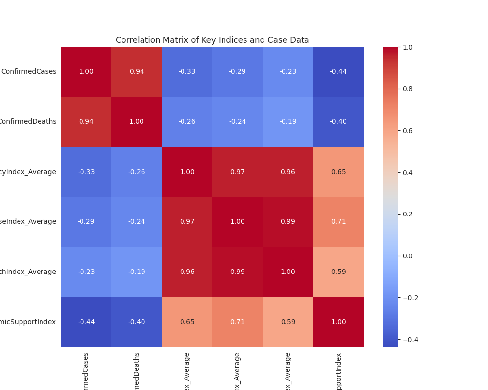
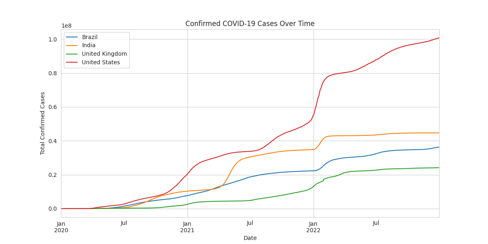
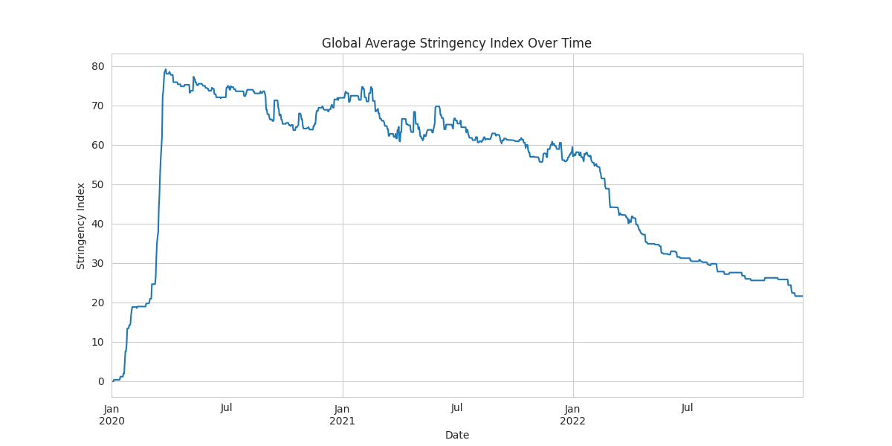

# COVID-19 Government Response Impact Analysis

## Table of Contents
- [Project Overview](#project-overview)
- [Business Problem](#business-problem)
- [Data Description](#data-description)
- [Data Cleaning & Preprocessing](#data-cleaning--preprocessing)
- [Exploratory Data Analysis (EDA)](#exploratory-data-analysis-eda)
- [Feature Engineering](#feature-engineering)
- [Modeling](#modeling)
- [Evaluation](#evaluation)
- [Results & Discussion](#results--discussion)
- [Conclusion](#conclusion)
- [Future Work](#future-work)
- [References](#references)
- [Appendix](#appendix)

---

## Project Overview
- This project conducts an in-depth analysis of the Oxford COVID-19 Government Response Tracker (OxCGRT) dataset. 

- The primary objective is to understand the relationship between various government policies, public health measures, and the progression of the COVID-19 pandemic. 

- By analyzing data on school closures, economic support, and vaccination policies alongside case and death numbers, this project aims to uncover patterns and insights into the effectiveness of different interventions. 

- The expected outcome is a comprehensive report and a predictive model that can serve as a resource for public health officials and researchers.

## Business Problem
Public health organizations and governments worldwide have been faced with the monumental task of making critical decisions to curb the spread of COVID-19, often with incomplete information. 

The challenge is to implement policies that effectively control the virus while minimizing negative economic and social impacts. 

This project addresses the need for data-driven insights into policy effectiveness. The goal is to answer key questions such as:
 * Which government interventions (e.g., lockdowns, mask mandates) are most strongly correlated with a reduction in case growth?
 * What is the typical time lag between the implementation of a policy and its impact on confirmed cases?
 * Can we build a model to forecast future case numbers based on current government policies and health measures?

## Data Description
The data for this project is the Oxford COVID-19 Government Response Tracker (OxCGRT) dataset.
 * Source: Oxford University, Blavatnik School of Government
 * Format: CSV (OxCGRT_National_Subnational.csv)
 * Key Variables: The dataset contains over 50 variables, including:
   * Identifiers: CountryName, CountryCode, RegionName, Date.
   * Policy Measures (Categorical): A wide range of containment policies (e.g., C1M_School.closing, C6M_Stay.at.home.requirements), health policies (e.g., H2_Testing.policy, H7_Vaccination.policy), and economic support policies (e.g., E1_Income.support).
   * Case Data (Numeric): ConfirmedCases, ConfirmedDeaths.
   * Indices (Numeric): Pre-calculated indices that summarize policy stringency, such as StringencyIndex_Average, GovernmentResponseIndex_Average, ContainmentHealthIndex_Average.

## Data Cleaning & Preprocessing
A rigorous data cleaning and preprocessing pipeline was implemented to prepare the data for analysis. The key steps, guided by an initial ydata-profiling report, were:
 * Handling Missing Values:
   * Dropped Columns: Columns with >75% missing values were removed, including CityName, CityCode, E3_Fiscal.measures, and H4_Emergency.investment.in.healthcare, as imputation would be unreliable.

   * Categorical Imputation: Missing values in categorical _Flag columns were imputed using the mode (most frequent value) for each respective column.

   * Time-Series Imputation: Missing ConfirmedCases and ConfirmedDeaths were handled using forward-fill (ffill) to propagate the last valid observation forward, which is appropriate for cumulative time-series data.

 * Correcting Data Types:
   * The Date column was converted from an integer to a proper datetime object for time-series analysis.
   * The PopulationVaccinated column was inspected for non-numeric characters, cleaned, and converted to a numeric type.

 * Managing High Correlation:
   * A correlation heatmap was generated to visualize multicollinearity.
   * For highly correlated feature pairs (e.g., various policy indices), one feature from each pair was selected to avoid redundancy, or Principal Component Analysis (PCA) was used to create a smaller set of uncorrelated components.

 * Addressing Skewness:
   * Highly skewed numeric features like H5_Investment.in.vaccines were transformed using a logarithmic transformation (log(x+1)) to normalize their distributions, improving the performance of certain machine learning models.

## Exploratory Data Analysis (EDA)
EDA was conducted to uncover initial patterns and insights. Key visualizations and findings include:
 * Global Response Mapping: A choropleth map was used to visualize the StringencyIndex_Average across the globe at different time points, revealing regional differences in policy responses.

 * Time-Series Analysis: Line charts plotting ConfirmedCases and ConfirmedDeaths over time for various countries showed the different waves of the pandemic. Policy implementation dates were overlaid on these charts to visually inspect their potential impact.

 * Policy Correlation: A heatmap of policy and index variables confirmed the high correlation between measures like school closures, workplace closures, and stay-at-home requirements.

 * Distribution of Indices: Histograms of the StringencyIndex_Average and GovernmentResponseIndex_Average revealed the distribution of government response intensity over the course of the pandemic.

## Feature Engineering
To enhance the predictive power of our models, several new features were created:
 * Lag Features: The impact of policies is not instantaneous. Lagged features for ConfirmedCases and policy measures (e.g., cases 7 and 14 days ago) were created to capture delayed effects.

 * Rolling Averages: To smooth out daily fluctuations and identify trends, 7-day and 14-day rolling averages were calculated for ConfirmedCases and ConfirmedDeaths.

 * Case Growth Rate: A feature representing the daily percentage change in confirmed cases was engineered to model the speed of the pandemic's spread.

## Modeling
Several models were developed to address the project's predictive goals.
 * Forecasting Confirmed Cases:
   * Algorithm: ARIMA (Autoregressive Integrated Moving Average) and Prophet (by Facebook) were used for time-series forecasting of future ConfirmedCases.
   * Selection: These models were chosen for their ability to handle time-series data with trends and seasonality. Prophet is particularly robust to missing data and shifts in trends.
   * Tuning: For ARIMA, the p, d, and q parameters were optimized using grid search and an analysis of ACF and PACF plots.
 * Predicting Government Stringency:
   * Algorithm: A Gradient Boosting Regressor (e.g., XGBoost) was trained to predict the StringencyIndex_Average.
   * Features: The model used features like the current number of cases, case growth rate, and health system policies.
   * Purpose: This helps understand the key drivers behind government decisions to tighten or loosen restrictions.

## Evaluation
The models were rigorously evaluated to ensure their performance and reliability.
 * Time-Series Validation: A time-based train-test split was used, where the model was trained on an earlier period and tested on a later period to simulate a real-world forecasting scenario.
 * Metrics:
   * For the forecasting models (ARIMA, Prophet), Mean Absolute Error (MAE) and Root Mean Squared Error (RMSE) were used to measure prediction accuracy.
   * For the regression model (XGBoost), R-squared (R²) and MAE were used to assess its ability to explain the variance in the stringency index.

## Results & Discussion
The analysis and modeling yielded several key insights:
 * The implementation of stringent measures like stay-at-home requirements and school closures was visually correlated with a flattening of the curve in ConfirmedCases, typically with a lag of 2-3 weeks.
 * The Prophet model demonstrated strong performance in forecasting short-term case trends, providing a useful tool for resource planning.
 * The XGBoost model identified the Case Growth Rate and ConfirmedDeaths as the most significant predictors of an increase in the StringencyIndex_Average, confirming that governments primarily react to accelerating outbreaks.
 * Limitation: This analysis is correlational, not causal. While we can observe relationships, we cannot definitively prove that a specific policy caused a specific outcome without a more formal causal inference study.

## Conclusion
This project successfully analyzed the complex OxCGRT dataset to provide data-driven insights into the global response to the COVID-19 pandemic. We demonstrated that government policies have a measurable, though delayed, correlation with pandemic trends. The developed forecasting model can serve as a valuable asset for short-term strategic planning. The primary recommendation for public health officials is to act decisively and early, as the data suggests that reactive policy changes occur after significant growth in cases is already underway.

## Future Work
There are several avenues for extending this project:
 * Causal Inference Analysis: Employ more advanced statistical methods like Granger causality or Difference-in-Differences to move from correlation to causation.
 * Economic Impact Modeling: Integrate economic datasets (e.g., GDP, unemployment rates) to perform a more robust analysis of the economic trade-offs of different policies.
 * Sentiment Analysis: Incorporate news and social media data to analyze public sentiment and its influence on government policy decisions.

## References
 * Hale, Thomas, Noam Angrist, Rafael Goldszmidt, Beatriz Kira, Anna Petherick, Toby Phillips, Samuel Webster, Emily Cameron-Blake, Laura Hallas, Saptarshi Majumdar, and Helen Tatlow. (2021). "A global panel database of pandemic policies (Oxford COVID-19 Government Response Tracker)." Nature Human Behaviour. https://doi.org/10.1038/s41562-021-01079-8

## Appendix
This section can include:
 * A complete data dictionary for all variables used.
 * Additional charts and visualizations not included in the main report.
 * Code snippets for key functions or modeling steps.
